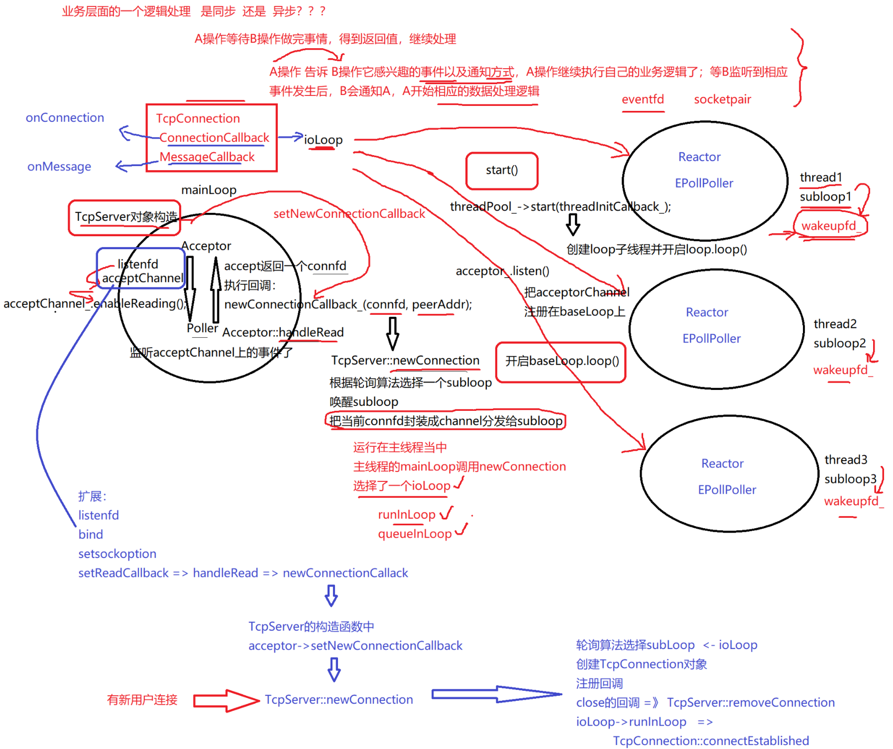

# 1. 项目介绍
本项目仿照 muduo 项目, 移除了原项目对 boost 库的依赖，采用 C++ 的标准库实现。
本项目进行实现了有关TCP Server 功能的相关部分。
# 2. 项目流程

# 3. 使用示例
```cpp
#include <mymuduo/tcp_server.h>
#include <mymuduo/logger.h>
#include <mymuduo/callbacks.h>
#include <mymuduo/buffer.h>
#include <mymuduo/event_loop.h>
#include <mymuduo/tcp_connection.h>
#include <mymuduo/channel.h>
#include <mymuduo/current_thread.h>

#include <string>
#include <functional>

class EchoServer
{
public:
    EchoServer(EventLoop *loop,
            const InetAddress &addr, 
            const std::string &name)
        : server_(loop, addr, name)
        , loop_(loop)
    {
        // 注册回调函数
        server_.SetConnectionCallback(
            std::bind(&EchoServer::onConnection, this, std::placeholders::_1)
        );

        server_.SetMessageCallback(
            std::bind(&EchoServer::onMessage, this,
                std::placeholders::_1, std::placeholders::_2, std::placeholders::_3)
        );

        // 设置合适的loop线程数量 loopthread
        server_.SetThreadNum(3);
    }
    void start()
    {
        server_.Start();
    }
private:
    // 连接建立或者断开的回调
    void onConnection(const TcpConnectionPtr &conn)
    {
        if (conn->IsConnected())
        {
            LOG_INFO("Connection UP : %s", conn->PeerAddr().ToIpPort().c_str());
        }
        else
        {
            LOG_INFO("Connection DOWN : %s", conn->PeerAddr().ToIpPort().c_str());
        }
    }

    // 可读写事件回调
    void onMessage(const TcpConnectionPtr &conn,
                Buffer *buf,
                Timestamp time)
    {
        std::string msg = buf->RetrieveAsString();
        conn->Send(msg);
        conn->Shutdown(); // 写端   EPOLLHUP =》 closeCallback_
    }

    EventLoop *loop_;
    TcpServer server_;
};

int main()
{
    EventLoop loop;
    InetAddress addr("127.0.0.1", 8000);
    EchoServer server(&loop, addr, "EchoServer-01"); // Acceptor non-blocking listenfd  create bind 
    server.start(); // listen  loopthread  listenfd => acceptChannel => mainLoop =>
    loop.Loop(); // 启动mainLoop的底层Poller

    return 0;
}
```