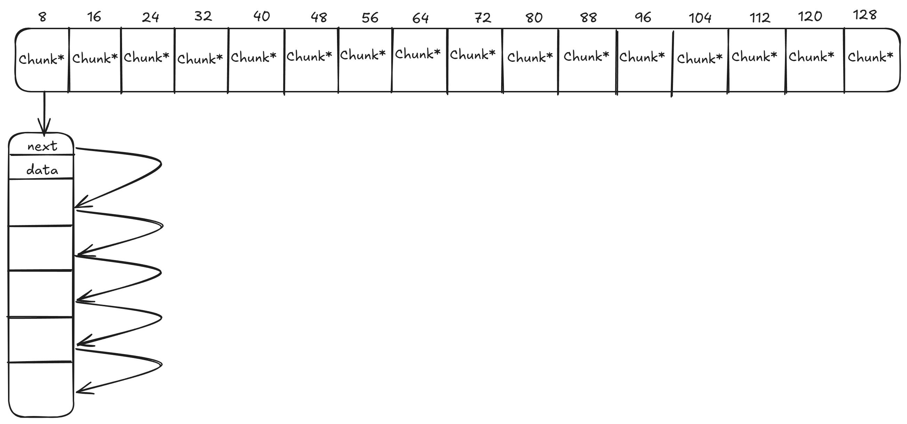

# 1. 概述
本项目是仿照 SGI STL 二级配置器实现的内存池，主要用于分配和管理内存。
小块内存采用内存池分配，大块内存直接调用系统 malloc 分配。
# 2. 架构

# 3. 测试代码
```cpp
#include "memory_pool.h"
#include <windows.h>  // 添加在文件开头
#include <iostream>
#include <vector>
#include <string>
#include <thread>
#include <chrono>
#include <cassert>
#include <cstring>

// 用于测试的简单类
class TestObject {
public:
    TestObject() : value_(0), name_("default") {
        std::cout << "TestObject constructed: " << name_ << std::endl;
    }
    
    TestObject(int val, const std::string& n) : value_(val), name_(n) {
        std::cout << "TestObject constructed: " << name_ << " with value " << value_ << std::endl;
    }
    
    ~TestObject() {
        std::cout << "TestObject destroyed: " << name_ << std::endl;
    }
    
    int getValue() const { return value_; }
    const std::string& getName() const { return name_; }
    
private:
    int value_;
    std::string name_;
};

// 测试基本的内存分配和释放功能
void testBasicAllocation() {
    std::cout << "=== 测试基本内存分配和释放 ===" << std::endl;
    
    MemoryPool pool;
    
    // 测试小内存分配
    void* p1 = pool.Allocate(16);
    assert(p1 != nullptr);
    std::cout << "分配了16字节内存，地址: " << p1 << std::endl;
    
    void* p2 = pool.Allocate(32);
    assert(p2 != nullptr);
    std::cout << "分配了32字节内存，地址: " << p2 << std::endl;
    
    // 释放内存
    pool.Deallocate(p1, 16);
    std::cout << "释放了16字节内存" << std::endl;
    
    pool.Deallocate(p2, 32);
    std::cout << "释放了32字节内存" << std::endl;
    
    // 重新分配应该能重用刚才释放的内存
    void* p3 = pool.Allocate(16);
    assert(p3 != nullptr);
    std::cout << "再次分配16字节内存，地址: " << p3 << std::endl;
    
    pool.Deallocate(p3, 16);
    std::cout << "基本内存分配测试完成\n" << std::endl;
}

// 测试对象的构造和析构
void testObjectConstruction() {
    std::cout << "=== 测试对象构造和析构 ===" << std::endl;
    
    MemoryPool pool;
    
    // 分配内存并构造对象
    void* p = pool.Allocate(sizeof(TestObject));
    TestObject* obj = static_cast<TestObject*>(p);
    pool.Construct(obj, 42, "testObject1");
    
    // 验证对象数据
    assert(obj->getValue() == 42);
    assert(obj->getName() == "testObject1");
    std::cout << "对象验证成功: value=" << obj->getValue() << ", name=" << obj->getName() << std::endl;
    
    // 析构对象并释放内存
    pool.Destory(obj);
    pool.Deallocate(p, sizeof(TestObject));
    std::cout << "对象构造和析构测试完成\n" << std::endl;
}

// 测试不同大小的内存分配
void testDifferentSizes() {
    std::cout << "=== 测试不同大小的内存分配 ===" << std::endl;
    
    MemoryPool pool;
    std::vector<void*> pointers;
    const size_t sizes[] = {8, 16, 24, 32, 40, 48, 56, 64, 128};
    
    // 分配不同大小的内存
    for (size_t size : sizes) {
        void* p = pool.Allocate(size);
        pointers.push_back(p);
        std::cout << "分配了" << size << "字节内存，地址: " << p << std::endl;
    }
    
    // 释放所有内存
    for (size_t i = 0; i < pointers.size(); ++i) {
        pool.Deallocate(pointers[i], sizes[i]);
        std::cout << "释放了" << sizes[i] << "字节内存" << std::endl;
    }
    
    std::cout << "不同大小内存分配测试完成\n" << std::endl;
}

// 测试大量小对象的分配和释放，验证内存池的效率
void testMassAllocation() {
    std::cout << "=== 测试大量小对象的分配和释放 ===" << std::endl;
    
    MemoryPool pool;
    const int numObjects = 10000;
    std::vector<void*> pointers;
    pointers.reserve(numObjects);
    
    auto start = std::chrono::high_resolution_clock::now();
    
    // 分配大量小对象
    for (int i = 0; i < numObjects; ++i) {
        void* p = pool.Allocate(16);
        pointers.push_back(p);
    }
    
    // 释放所有小对象
    for (void* p : pointers) {
        pool.Deallocate(p, 16);
    }
    
    auto end = std::chrono::high_resolution_clock::now();
    auto duration = std::chrono::duration_cast<std::chrono::milliseconds>(end - start);
    
    std::cout << "分配并释放了" << numObjects << "个16字节对象，耗时: " << duration.count() << "ms" << std::endl;
    std::cout << "大量小对象分配测试完成\n" << std::endl;
}

// 修改线程测试函数中的指针存储方式
void threadTestFunction(MemoryPool& pool, int threadId, int numOperations) {
    // 用pair记录指针和对应的分配尺寸（关键修复）
    std::vector<std::pair<void*, size_t>> pointers;

    for (int i = 0; i < numOperations; ++i) {
        size_t size = 8 + (rand() % 7) * 8; // 8,16,...,64
        void* p = pool.Allocate(size);
        memset(p, threadId, size);
        pointers.emplace_back(p, size); // 存储尺寸

        // 随机释放时使用正确尺寸（关键修复）
        if (rand() % 2 == 0 && !pointers.empty()) {
            size_t index = rand() % pointers.size();
            auto [ptr, sz] = pointers[index]; // 获取实际尺寸
            pool.Deallocate(ptr, sz);
            pointers[index] = pointers.back();
            pointers.pop_back();
        }

        std::this_thread::sleep_for(std::chrono::microseconds(1));
    }

    // 释放剩余内存时使用正确尺寸（关键修复）
    for (auto& [ptr, sz] : pointers) {
        pool.Deallocate(ptr, sz);
    }
}

// 测试多线程环境下的内存池操作
void testMultiThreading() {
    std::cout << "=== 测试多线程环境下的内存池操作开始 ===" << std::endl;
    std::cout.flush();

    MemoryPool pool;
    const int numThreads = 4;
    const int numOperationsPerThread = 1000;
    std::vector<std::thread> threads;

    auto start = std::chrono::high_resolution_clock::now();

    // 创建多个线程同时操作内存池
    for (int i = 0; i < numThreads; ++i) {
        threads.emplace_back(threadTestFunction, std::ref(pool), i, numOperationsPerThread);
    }

    // 等待所有线程完成
    for (auto& t : threads) {
        t.join();
    }

    auto end = std::chrono::high_resolution_clock::now();
    auto duration = std::chrono::duration_cast<std::chrono::milliseconds>(end - start);
    std::cout << numThreads << "个线程各自执行 " << numOperationsPerThread << " 次内存操作, 总耗时: " << duration.count() << "ms" << std::endl;
    //std::cout << numThreads << "个线程各自执行" << numOperationsPerThread << "次内存操作，总耗时: " << duration.count() << "ms" << std::endl;
    std::cout.flush();
    std::cout << "=== 测试多线程环境完成 ===\n" << std::endl;
    std::cout.flush();
}

// 测试Reallocate功能
void testReallocate() {
    std::cout << "=== 测试内存重分配功能 ===" << std::endl;
    
    MemoryPool pool;
    
    // 分配小内存
    void* p1 = pool.Allocate(16);
    assert(p1 != nullptr);
    std::cout << "初始分配16字节内存，地址: " << p1 << std::endl;
    
    // 写入一些数据
    memset(p1, 0xAA, 16);
    
    // 重分配为更大的内存
    void* p2 = pool.Reallocate(p1, 16, 32);
    assert(p2 != nullptr);
    std::cout << "重分配为32字节内存，地址: " << p2 << std::endl;
    
    // 验证数据是否保留（前16字节）
    bool dataRetained = true;
    for (int i = 0; i < 16; ++i) {
        if (static_cast<uint8_t*>(p2)[i] != 0xAA) {
            dataRetained = false;
            break;
        }
    }
    
    std::cout << "数据保留测试: " << (dataRetained ? "通过" : "失败") << std::endl;
    
    // 重分配为更小的内存
    void* p3 = pool.Reallocate(p2, 32, 8);
    assert(p3 != nullptr);
    std::cout << "重分配为8字节内存，地址: " << p3 << std::endl;
    
    pool.Deallocate(p3, 8);
    std::cout << "内存重分配测试完成\n" << std::endl;
}

int main() {
    SetConsoleOutputCP(CP_UTF8);
    std::cout << "===== SGI内存池测试程序 =====" << std::endl;
    
    try {
        // 运行各个测试
        testBasicAllocation();
        testObjectConstruction();
        testDifferentSizes();
        testMassAllocation();
        testReallocate();
        testMultiThreading();
        
        std::cout << "\n===== 所有测试通过! =====" << std::endl;
    } catch (const std::bad_alloc& e) {
        std::cerr << "\n测试失败：内存分配失败 - " << e.what() << std::endl;
        return 1;
    } catch (const std::exception& e) {
        std::cerr << "测试失败: " << e.what() << std::endl;
        return 1;
    }
    
    return 0;
}
```